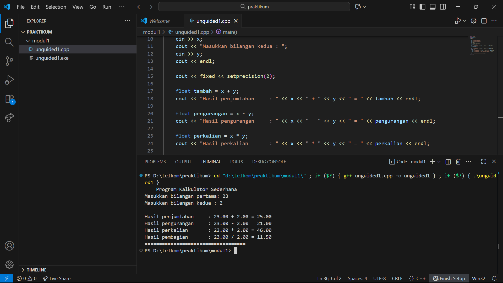
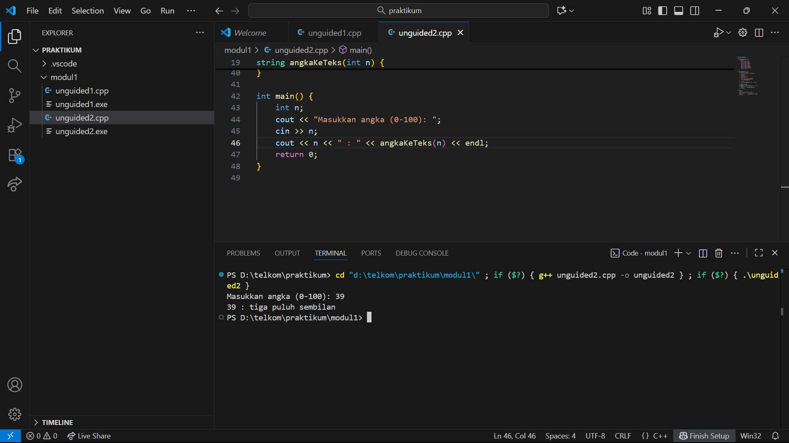
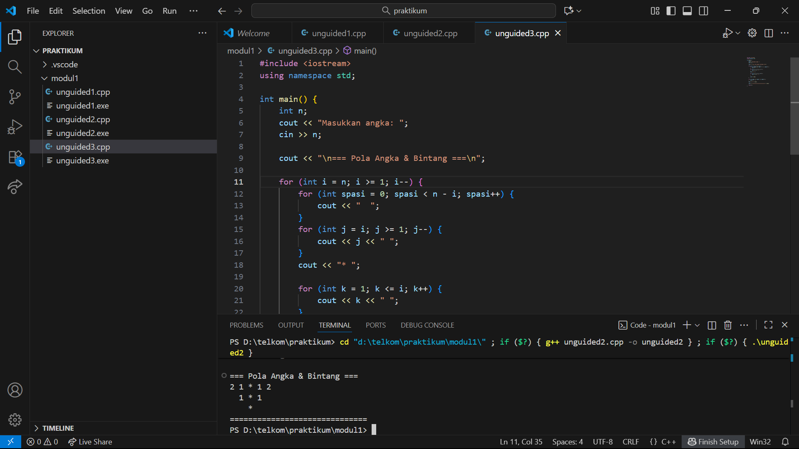

# <h1 align="center">Laporan Praktikum Modul 01 <br>  Pengenalan C++</h1>
<p align="center">Akbar Daniel Ruslan - 103112430248</p>

## Dasar Teori

Dalam bahasa C++,add beberapa konsep dasar penting buat dipahami, yaitu struct, aritmatika,kondisi, perulangan, dan fungsi. `Struct` Dipakai buat mengelompokkan beberapa variabel dengan tipe data berbeda ke dalam satu wadah agar pengelolaan data menjadi lebih mudah. Konsep aritmatika berkaitan dengan penggunaan operator seperti `+`, `-`, `*`, `/`, dan `%` untuk melakukan operasi matematika. Kondisi / percabangan (`if`, `else if`, `else`, `switch`) memungkinkan program mengambil keputusan dan menjalankan perintah tertentu berdasarkan syarat yang terpenuhi.Perulangan (`for`, `while`, `do while`) digunakan untuk mengeksekusi kode secara berulang tanpa perlu menulis instruksi yang sama berkali-kali. Sedangkan fungsi adalah sekumpulan perintah dalam satu blok kode yang bisa dipanggil kapan pun untuk melakukan tugas tertentu, sehingga program menjadi lebih terstruktur, mudah dibaca, dan efisien digunakan kembali.

## guided


### guide 1
```go
#include <iostream>
#include <string>
using namespace std;

// Definisi struct
struct Mahasiswa {
    string nama;
    string nim;
    float ipk;
};

int main() {

    Mahasiswa mhs1;

    cout << "Masukkan Nama Mahasiswa: ";
    getline(cin, mhs1.nama);
    cout << "Masukkan NIM Mahasiswa : ";
    cin >> mhs1.nim;
    cout << "Masukkan IPK Mahasiswa : ";
    cin >> mhs1.ipk;

    cout << "\n=== Data Mahasiswa ===" << endl;
    cout << "Nama : " << mhs1.nama << endl;
    cout << "NIM  : " << mhs1.nim << endl;
    cout << "IPK  : " << mhs1.ipk << endl;

    return 0;
}
```

### guide 2
```go
#include <iostream>
using namespace std;
int main()
{
    int W, X, Y;
    float Z;
    X = 7;
    Y = 3;
    W = 1;
    Z = (X + Y) / (Y + W);
    cout << "Nilai z = " << Z << endl;
    return 0;
}
```

### guide 3
```go
#include <iostream>
using namespace std;

int main()
{
    int kode_hari;
    cout << "Menentukan hari kerja/libur\n"<<endl;
    cout << "1=Senin 3=Rabu 5=Jumat 7=Minggu "<<endl;
    cout << "2=Selasa 4=Kamis 6=Sabtu "<<endl;
    cin >> kode_hari;
    switch (kode_hari)
    {
    case 1:
    case 2:
    case 3:
    case 4:
    case 5:
        cout<<"Hari Kerja";
        break;
    case 6:
    case 7:
        cout<<"Hari Libur";
        break;
    default:
        cout<<"Kode masukan salah!!!";
    }
    return 0;
}
```

### guide 4
```go
#include <iostream>
using namespace std;

int main()
{
    int i = 1;
    int jum;
    cin >> jum;
    do
    {
        cout << "bahlil ke-" << (i + 1) << endl;
        i++;
    } while (i < jum);
    return 0;
}
```

### guide 5
```go
#include <iostream>
using namespace std;

// Prosedur: hanya menampilkan hasil, tidak mengembalikan nilai
void tampilkanHasil(double p, double l)
{
    cout << "\n=== Hasil Perhitungan ===" << endl;
    cout << "Panjang : " << p << endl;
    cout << "Lebar   : " << l << endl;
    cout << "Luas    : " << p * l << endl;
    cout << "Keliling: " << 2 * (p + l) << endl;
}

// Fungsi: mengembalikan nilai luas
double hitungLuas(double p, double l)
{
    return p * l;
}

// Fungsi: mengembalikan nilai keliling
double hitungKeliling(double p, double l)
{
    return 2 * (p + l);
}

int main()
{
    double panjang, lebar;

    cout << "Masukkan panjang: ";
    cin >> panjang;
    cout << "Masukkan lebar  : ";
    cin >> lebar;

    // Panggil fungsi
    double luas = hitungLuas(panjang, lebar);
    double keliling = hitungKeliling(panjang, lebar);

    cout << "\nDihitung dengan fungsi:" << endl;
    cout << "Luas      = " << luas << endl;
    cout << "Keliling  = " << keliling << endl;

    // Panggil prosedur
    tampilkanHasil(panjang, lebar);

    return 0;
}

```

### guide 6
```go
#include <iostream>
using namespace std;
int main()
{
    string ch;
    cout << "Masukkan sebuah karakter: ";
    // cin >> ch;
    ch = getchar();  //Menggunakan getchar() untuk membaca satu karakter
    cout << "Karakter yang Anda masukkan adalah: " << ch << endl;
    return 0;
}
```


## Unguided

### Soal 1

Buatlah program yang menerima input-an dua buah bilangan betipe float, kemudian memberikan output-an hasil penjumlahan, pengurangan, perkalian, dan pembagian dari dua bilangan tersebut.

```go
#include <iostream>
#include <iomanip>
using namespace std;

int main() {
    float x, y;

    cout << "=== Program Kalkulator Sederhana ===" << endl;
    cout << "Masukkan bilangan pertama: ";
    cin >> x;
    cout << "Masukkan bilangan kedua : ";
    cin >> y;
    cout << endl;

    cout << fixed << setprecision(2); 

    float tambah = x + y;
    cout << "Hasil penjumlahan     : " << x << " + " << y << " = " << tambah << endl;

    float pengurangan = x - y;
    cout << "Hasil pengurangan     : " << x << " - " << y << " = " << pengurangan << endl;

    float perkalian = x * y;
    cout << "Hasil perkalian       : " << x << " * " << y << " = " << perkalian << endl;

    if (y != 0) {
        float pembagian = x / y;
        cout << "Hasil pembagian       : " << x << " / " << y << " = " << pembagian << endl;
    } else {
        cout << "Hasil pembagian       : Tidak dapat dilakukan (pembagi = 0)" << endl;
    }

    cout << "===================================" << endl;

    return 0;
}

```

> Output
> 

Program ini merupakan kalkulator sederhana yang dibuat menggunakan bahasa C++. Cara kerjanya cukup mudah: pengguna memasukkan dua angka, lalu program akan menampilkan hasil penjumlahan, pengurangan, perkalian, serta pembagian dari kedua angka tersebut secara otomatis. Untuk operasi pembagian, sudah disertakan pengecekan agar jika angka kedua bernilai nol, program akan menampilkan pesan bahwa pembagian tidak dapat dilakukan. Dengan begitu, program ini memudahkan pengguna untuk menghitung operasi dasar dengan cepat dan aman langsung melalui terminal.

### Soal 2

Buatlah sebuah program yang menerima masukan angka dan mengeluarkan output nilai angka tersebut dalam bentuk tulisan. Angka yang akan di-input-kan user adalah bilangan bulat positif mulai dari 0 s.d 100.

```go
#include <iostream>
using namespace std;

string satuanKeTeks(int n) {
    switch (n) {
        case 1: return "satu";
        case 2: return "dua";
        case 3: return "tiga";
        case 4: return "empat";
        case 5: return "lima";
        case 6: return "enam";
        case 7: return "tujuh";
        case 8: return "delapan";
        case 9: return "sembilan";
        default: return "";
    }
}

string angkaKeTeks(int n) {
    if (n < 0 || n > 100)
        return "Input di luar jangkauan";
    if (n == 0)
        return "nol";
    if (n == 100)
        return "seratus";
    if (n < 12) {
        if (n == 10) return "sepuluh";
        if (n == 11) return "sebelas";
        return satuanKeTeks(n);
    }
    if (n < 20)
        return satuanKeTeks(n - 10) + " belas";

    int puluh = n / 10;
    int satu = n % 10;
    string hasil = satuanKeTeks(puluh) + " puluh";
    if (satu > 0)
        hasil += " " + satuanKeTeks(satu);
    return hasil;
}

int main() {
    int n;
    cout << "Masukkan angka (0-100): ";
    cin >> n;
    cout << n << " : " << angkaKeTeks(n) << endl;
    return 0;
}


```

> Output
> 

Program C++ ini untuk mengubah angka dari 0 hingga 100 menjadi bentuk tulisan dalam bahasa Indonesia. Saat pengguna memasukkan sebuah angka, program terlebih dahulu memeriksa apakah angka tersebut berada dalam rentang yang valid. Jika angkanya kurang dari 0 atau lebih dari 100, maka program akan menampilkan pesan bahwa input berada di luar jangkauan. Angka khusus seperti 0 akan ditampilkan sebagai “nol” dan 100 sebagai “seratus”. Untuk bilangan di bawah 12, program menampilkan kata sesuai dengan sebutan angkanya secara langsung. Bilangan antara 12 hingga 19 ditulis menggunakan format “... belas”, seperti 15 menjadi “lima belas”. Sementara untuk angka 20 hingga 99, program memecahnya menjadi bagian puluhan dan satuan, kemudian menggabungkannya agar menghasilkan bentuk kata yang benar, misalnya angka 73 menjadi “tujuh puluh tiga”. Dengan logika ini, program mampu menampilkan hasil konversi angka ke dalam bentuk kata yang jelas, akurat, dan mudah dibaca.


### Soal 3

Buatlah program yang dapat memberikan input dan output sbb.

```go
#include <iostream>
using namespace std;

int main() {
    int n;
    cout << "Masukkan angka: ";
    cin >> n;

    cout << "\n=== Pola Angka & Bintang ===\n";

    for (int i = n; i >= 1; i--) {
        for (int spasi = 0; spasi < n - i; spasi++) {
            cout << "  ";
        }
        for (int j = i; j >= 1; j--) {
            cout << j << " ";
        }
        cout << "* ";

        for (int k = 1; k <= i; k++) {
            cout << k << " ";
        }

        cout << endl;
    }

    for (int spasi = 0; spasi < n; spasi++) {
        cout << "  ";
    }
    cout << "*" << endl;

    cout << "==============================" << endl;

    return 0;
}

```

> Output
> 

Program C++ ini berfungsi untuk menampilkan pola simetris yang terdiri dari angka dan simbol bintang berdasarkan input yang dimasukkan oleh pengguna. Pola dimulai dengan deretan angka menurun di sisi kiri, sebuah bintang di tengah, dan angka menaik di sisi kanan. Setiap baris berikutnya menampilkan jumlah angka yang semakin sedikit sehingga membentuk pola yang menyempit ke bawah. Spasi di awal setiap baris digunakan untuk menjaga keseimbangan tampilan agar tetap simetris. Pada bagian akhir, program menampilkan satu bintang di posisi tengah sebagai titik akhir pola. Secara keseluruhan, hasilnya menyerupai bentuk segitiga terbalik yang berpusat pada simbol `*`.
