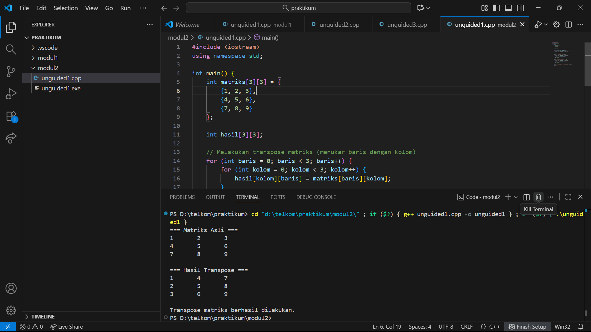
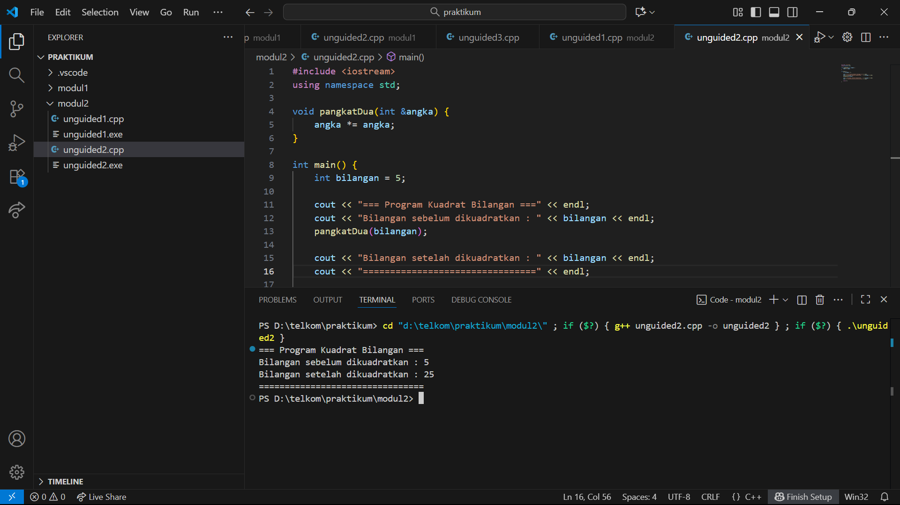

# <h1 align="center">Laporan Praktikum Modul 02 <br> PENGENALAN BAHASA C++ (BAGIAN KEDUA)</h1>
<p align="center">Akbar Daniel Ruslan - 103112430248</p>

## Dasar Teori
Dasar teori dari program ini berkaitan dengan **konsep fungsi dan pemanggilan dengan referensi (*call by reference*)** dalam bahasa C++. Berdasarkan Modul 2 “Pengenalan Bahasa C++ (Bagian Kedua)” pada mata kuliah Struktur Data, *call by reference* merupakan cara pengiriman parameter di mana alamat memori variabel asli dikirim ke fungsi, bukan salinan nilainya. Dengan cara ini, setiap perubahan pada parameter di dalam fungsi akan langsung berdampak pada variabel aslinya di luar fungsi. Pada program tersebut, fungsi `kuadratkan(int &x)` memanfaatkan parameter referensi (ditandai dengan simbol `&`), sehingga ketika nilai `x` diubah menjadi hasil kuadratnya (`x = x * x`), variabel `nilai` di dalam fungsi `main()` juga ikut berubah. Pendekatan ini membuat manipulasi data lebih efisien karena tidak perlu menggunakan *return statement* dan dapat menghindari duplikasi data di memori.

## Guided

### array
```go
#include <iostream>
using namespace std;

int main() {

    int nilai[5] = {1, 2, 3, 4, 5};

    for ( int i = 0;  i < 5; i++)
    {
       
        cout << "elemen ke-" << i << "=" << nilai[i] << endl;
    }
    return 0;
} 
```

### array 2
```go
#include <iostream>
using namespace std;

int main()
{
    char pesan_array[] = "Nasi Padang";
    char *pesan_pointer = "Ayam Bakar 23";

    cout << "String Array : " << pesan_array << endl;
    cout << "String Pointer : " << pesan_pointer << endl;

    // Mengubah karakter dalam array diperbolehkan
    pesan_array[0] = 'h';
    cout << "String Array setelah diubah: " << pesan_array << endl;

    // Pointer dapat diubah untuk menunjuk ke string lain
    pesan_pointer = "Sariaman";
    cout << "String Pointer setelah menunjuk ke string lain: " << pesan_pointer << endl;

    return 0;
}
```


### matriks
```go
#include <iostream>
using namespace std;

int main(){
    int matriks[3][3] ={
        {1, 2, 3},
        {4, 5, 6},
        {7, 8, 9}};

    for (int i = 0; i < 3; i++)
        {
        for (int j = 0; j < 3; j++)
    {
            cout << matriks[i][j]<< " ";
    }
    cout << endl;

    }
    return 0;
}
```

### pointer
```go
#include <iostream>
using namespace std;

int main()
{
    int umur = 25;
    int *p_umur;

    p_umur = &umur;

    cout << "Nilai 'umur': " << umur << endl;
    cout << "Alamat memori 'umur': " << &umur << endl;
    cout << "Nilai 'p_umur' (alamat): " << p_umur << endl;
    cout << "Nilai yang diakses 'p_umur': " << p_umur << endl;
    cout << "Alamat memori dari pointer 'p_umur' itu sendiri: " << p_umur << endl;
    return 0;
}
```

### array_pointer
```go
#include <iostream>
using namespace std;

int main()
{
    int data[5] = {10, 20, 30, 40, 50};
    int *p_data = data;

    cout << "Mengakses elemen array cara normal:" << endl;

    for (int i = 0; i < 5; ++i)
    {
        cout << "Nilai elemen ke-" << i << " : " << data[i] << endl;
    }

    cout << "Mengakses elemen array menggunakan pointer:" << endl;

    for (int i = 0; i < 5; ++i)
    {
        cout << "Nilai elemen ke-" << i << " : " << *(p_data + i) << endl;
    }

    return 0;
}
```

### string_pointer
```go
#include <iostream>
using namespace std;

int main()
{
    char pesan_array[] = "Nasi Padang";
    char *pesan_pointer = "Ayam Bakar 23";

    cout << "String Array: " << pesan_array << endl;
    cout << "String Pointer: " << pesan_pointer << endl;

    // Mengubah karakter dalam array diperbolehkan
    pesan_array[0] = 'h';
    cout << "String Array setelah diubah: " << pesan_array << endl;

    // Pointer dapat diubah untuk menunjuk ke string lain
    pesan_pointer = "Sariman";
    cout << "String Pointer setelah menunjuk ke string lain: " << pesan_pointer << endl;

    return 0;
}
```

### call by pointer

```go
#include <iostream>
using namespace std;

int main()
{
    int a = 10, b = 20;
    cout << "Sebelum ditukar: a = " << a << ", b = " << b << endl;
    tukar(&a, &b);
    cout << "Setelah ditukar: a = " << a << ", b = " << b << endl;
    return 0;
}

void tukar(int *px, int *py)
{
    int temp = *px;
    *px = *py;
    *py = temp;
}
```

### call by reference

```go
#include <iostream>
using namespace std;

int main()
{
    int a = 10, b = 20;
    cout << "Sebelum ditukar: a = " << a << ", b = " << b << endl;
    tukar(a, b);
    cout << "Setelah ditukar: a = " << a << ", b = " << b << endl;
    return 0;
}

void tukar(int &x, int &y)
{
    int temp = x;
    x = y;
    y = temp;
}
```

## Unguided

### Soal 1

Buatlah sebuah program untuk melakukan transpose pada sebuah matriks persegi berukuran 3x3. Operasi transpose adalah mengubah baris menjadi kolom dan sebaliknya. Inisialisasi matriks awal di dalam kode, kemudian buat logika untuk melakukan transpose dan simpan hasilnya ke dalam matriks baru. Terakhir, tampilkan matriks awal dan matriks hasil transpose.

Contoh Output:

Matriks Awal:
1 2 3
4 5 6
7 8 9

Matriks Hasil Transpose:
1 4 7
2 5 8
3 6 9


```go
#include <iostream>
using namespace std;

int main() {
    int matriks[3][3] = {
        {1, 2, 3},
        {4, 5, 6},
        {7, 8, 9}
    };

    int hasil[3][3];

    // Melakukan transpose matriks (menukar baris dengan kolom)
    for (int baris = 0; baris < 3; baris++) {
        for (int kolom = 0; kolom < 3; kolom++) {
            hasil[kolom][baris] = matriks[baris][kolom];
        }
    }

    cout << "=== Matriks Asli ===" << endl;
    for (int baris = 0; baris < 3; baris++) {
        for (int kolom = 0; kolom < 3; kolom++) {
            cout << matriks[baris][kolom] << "\t";
        }
        cout << endl;
    }

    cout << "\n=== Hasil Transpose ===" << endl;
    for (int baris = 0; baris < 3; baris++) {
        for (int kolom = 0; kolom < 3; kolom++) {
            cout << hasil[baris][kolom] << "\t";
        }
        cout << endl;
    }

    cout << "\nTranspose matriks berhasil dilakukan." << endl;

    return 0;
}
```

> Output
> 

Program C++ ini berfungsi untuk menampilkan hasil transpose dari sebuah matriks berukuran 3×3. Proses transpose dilakukan dengan cara menukar posisi elemen baris menjadi kolom dan kolom menjadi baris, yang secara logika ditulis sebagai `hasil[kolom][baris] = matriks[baris][kolom]`. Setelah proses penukaran selesai, program menampilkan matriks asli dan hasil transposenya secara terpisah agar perbedaan keduanya terlihat jelas. Konsep transpose ini sangat berguna dalam berbagai bidang komputasi, seperti pengolahan data numerik, perhitungan aljabar linear, hingga aplikasi pada grafika komputer yang melibatkan manipulasi koordinat dan transformasi matriks.


### Soal 2

Buatlah program yang menunjukkan penggunaan call by reference. Buat sebuah prosedur bernama kuadratkan yang menerima satu parameter integer secara referensi (&). Prosedur ini akan mengubah nilai asli variabel yang dilewatkan dengan nilai kuadratnya. Tampilkan nilai variabel di main() sebelum dan sesudah memanggil prosedur untuk membuktikan perubahannya. 

Contoh Output:

Nilai awal: 5
Nilai setelah dikuadratkan: 25

```go
#include <iostream>
using namespace std;

void pangkatDua(int &angka) {
    angka *= angka;
}

int main() {
    int bilangan = 5;

    cout << "=== Program Kuadrat Bilangan ===" << endl;
    cout << "Bilangan sebelum dikuadratkan : " << bilangan << endl;
    pangkatDua(bilangan);

    cout << "Bilangan setelah dikuadratkan : " << bilangan << endl;
    cout << "================================" << endl;

    return 0;
}
```

> Output
> 

Program C++ ini memperlihatkan penggunaan fungsi dengan parameter referensi (*call by reference*). Fungsi `pangkatDua(int &angka)` menerima sebuah variabel dengan tanda `&`, yang berarti fungsi tidak bekerja dengan salinan nilai, melainkan langsung pada variabel aslinya. Ketika fungsi dijalankan, nilai dari variabel tersebut dikalikan dengan dirinya sendiri sehingga berubah menjadi hasil kuadratnya. Dalam contoh program, nilai awal 5 diubah menjadi 25 setelah fungsi dipanggil, tanpa menggunakan pernyataan `return`. Konsep ini sangat efisien karena memungkinkan perubahan langsung terhadap variabel asli tanpa perlu membuat salinan baru di memori.
