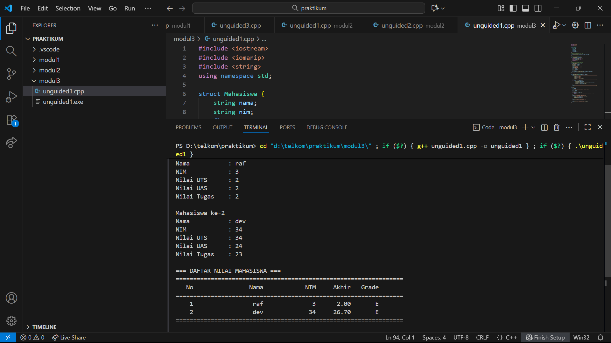
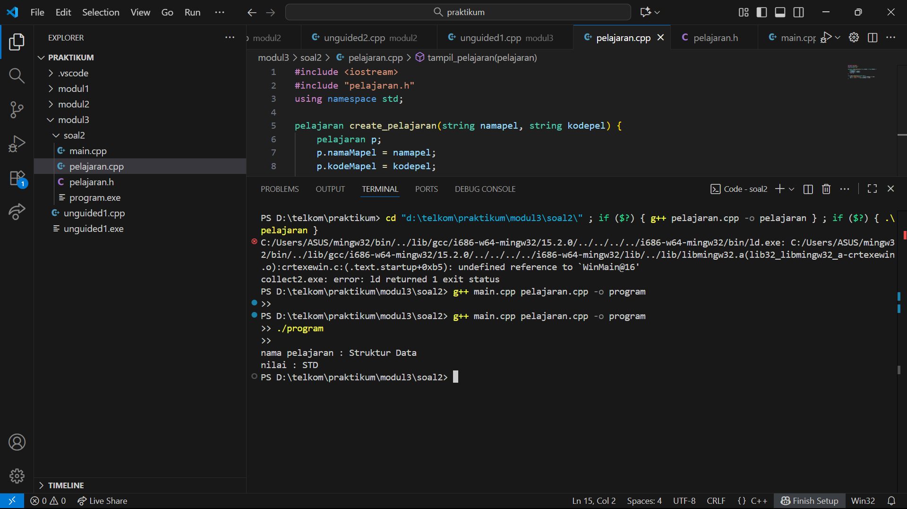
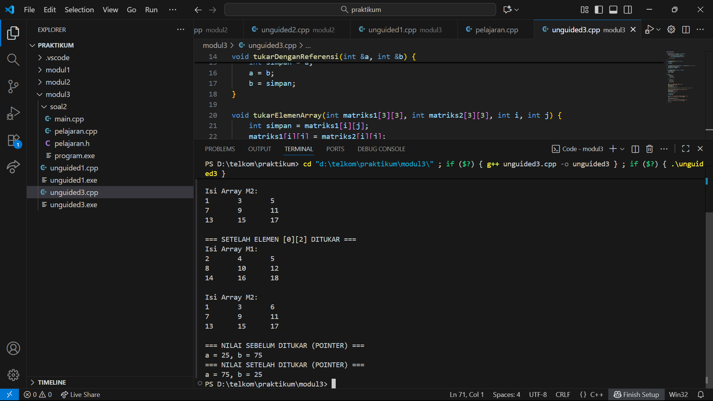

# <h1 align="center">Laporan Praktikum Modul 03 <br> Abstract Data Type</h1>
<p align="center">Akbar Daniel Ruslan - 103112430248</p>

## Dasar Teori
Dasar teori dari program tersebut berkaitan dengan Abstract Data Type (ADT), yaitu konsep dasar dalam pemrograman terstruktur yang digunakan untuk mendefinisikan tipe data baru beserta operasi-operasi dasar yang dapat dilakukan terhadapnya. Disebut abstrak karena pengguna hanya perlu mengetahui fungsi atau operasi yang tersedia tanpa harus memahami cara kerjanya secara internal. Dalam ADT biasanya terdapat konstruktor untuk membuat objek, selector untuk mengambil nilai, mutator untuk mengubah nilai, validator untuk memeriksa keabsahan data, destruktor untuk menghapus objek, serta operator relasional, aritmatika, dan fungsi input/output sebagai antarmuka. Implementasi ADT umumnya dibagi menjadi dua bagian, yaitu file header (.h) yang berisi deklarasi tipe data dan fungsi, serta file implementasi (.cpp) yang berisi realisasi dari fungsi-fungsi tersebut. Pemisahan antara spesifikasi dan implementasi ini menjadikan program lebih modular, mudah digunakan kembali (reusable), dan lebih sederhana untuk dikelola.


## Guided

### Menghitung Rata Rata

### mahasiswa.h
```go
#ifndef MAHASISWA_H_INCLUDED
#define MAHASISWA_H_INCLUDED

struct mahasiswa
{
    char nim[10];
    int nilai1, nilai2;
};

void inputMhs(mahasiswa &m);
float rata2(mahasiswa m);

#endif
```

### Mahasiswa.cpp
```go
#include "mahasiswa.h"
#include <iostream>
using namespace std;

void inputMhs(mahasiswa &m)
{
    cout << "input nama = ";
    cin >> (m) .nim;
    cout << "input nilai = ";
    cin >> (m) .nilai1;
    cout << "input niali2 = ";
    cin >> m .nilai2;

}
float rata2(mahasiswa m)
{
    return float(m.nilai1 + m.nilai2) / 2;
}
```

### main.cpp
```go
#include <iostream>
#include "mahasiswa.h"
using namespace std;

int main(){
    mahasiswa mhs;
    inputMhs(mhs);
    cout << "rata rata = " << rata2(mhs);
    return 0;
}
```

## Unguided

### Soal 1

Buat program yang dapat menyimpan data mahasiswa (max. 10) ke dalam sebuah array
dengan field nama, nim, uts, uas, tugas, dan nilai akhir. Nilai akhir diperoleh dari FUNGSI
dengan rumus 0.3*uts+0.4*uas+0.3*tugas.

```go
#include <iostream>
#include <iomanip>
#include <string>
using namespace std;

struct Mahasiswa {
    string nama;
    string nim;
    float uts;
    float uas;
    float tugas;
    float nilaiAkhir;
    char grade;
};

// Fungsi untuk menghitung nilai akhir
float hitungNilaiAkhir(float uts, float uas, float tugas) {
    return (0.3f * uts) + (0.4f * uas) + (0.3f * tugas);
}

// Fungsi untuk menentukan grade
char tentukanGrade(float nilai) {
    if (nilai >= 85) return 'A';
    else if (nilai >= 70) return 'B';
    else if (nilai >= 60) return 'C';
    else if (nilai >= 50) return 'D';
    else return 'E';
}

// Fungsi untuk input data mahasiswa
void inputMahasiswa(Mahasiswa &mhs) {
    cout << "Nama           : ";
    getline(cin, mhs.nama);
    cout << "NIM            : ";
    getline(cin, mhs.nim);
    cout << "Nilai UTS      : ";
    cin >> mhs.uts;
    cout << "Nilai UAS      : ";
    cin >> mhs.uas;
    cout << "Nilai Tugas    : ";
    cin >> mhs.tugas;
    cin.ignore();

    mhs.nilaiAkhir = hitungNilaiAkhir(mhs.uts, mhs.uas, mhs.tugas);
    mhs.grade = tentukanGrade(mhs.nilaiAkhir);
}

// Fungsi untuk menampilkan daftar mahasiswa
void tampilMahasiswa(Mahasiswa mhs[], int jumlah) {
    cout << "\n=================================================================\n";
    cout << setw(5) << "No"
         << setw(20) << "Nama"
         << setw(15) << "NIM"
         << setw(10) << "Akhir"
         << setw(8) << "Grade" << endl;
    cout << "=================================================================\n";

    for (int i = 0; i < jumlah; i++) {
        cout << setw(5) << i + 1
             << setw(20) << mhs[i].nama
             << setw(15) << mhs[i].nim
             << setw(10) << fixed << setprecision(2) << mhs[i].nilaiAkhir
             << setw(8) << mhs[i].grade << endl;
    }

    cout << "=================================================================\n";
}

int main() {
    Mahasiswa daftarMhs[10];
    int jumlah;

    cout << "Masukkan jumlah mahasiswa (maksimal 10): ";
    cin >> jumlah;
    cin.ignore();

    if (jumlah <= 0 || jumlah > 10) {
        cout << "Jumlah tidak valid! Harus antara 1 sampai 10." << endl;
        return 0;
    }

    cout << "\n=== INPUT DATA MAHASISWA ===\n";
    for (int i = 0; i < jumlah; i++) {
        cout << "\nMahasiswa ke-" << i + 1 << endl;
        inputMahasiswa(daftarMhs[i]);
    }

    cout << "\n=== DAFTAR NILAI MAHASISWA ===";
    tampilMahasiswa(daftarMhs, jumlah);

    cout << "\nProgram selesai dijalankan." << endl;
    return 0;
}


```

> Output
> 

Program C++ ini memanfaatkan struktur data struct untuk menyimpan dan mengelola informasi beberapa mahasiswa, yang meliputi nama, NIM, nilai UTS, UAS, tugas, nilai akhir, serta grade huruf. Proses perhitungan nilai akhir dilakukan melalui fungsi hitungNilaiAkhir(), yang mengalikan masing-masing komponen nilai dengan bobot tertentu. Selain itu, fungsi tentukanGrade() digunakan untuk menentukan nilai huruf berdasarkan nilai akhir mahasiswa. Data mahasiswa dimasukkan menggunakan fungsi inputMahasiswa() dengan parameter referensi agar perubahan nilai langsung tersimpan pada objek aslinya. Setelah semua data selesai diinput, fungsi tampilMahasiswa() akan menampilkan hasilnya dalam format tabel yang rapi menggunakan library <iomanip>.
### Soal 2
### pelajaran.h
```go
#ifndef PELAJARAN_H_INCLUDED
#define PELAJARAN_H_INCLUDED

#include <string>
using namespace std;

struct pelajaran {
    string namaMapel;
    string kodeMapel;
};

pelajaran create_pelajaran(string namapel, string kodepel);

void tampil_pelajaran(pelajaran pel);

#endif
```
### pelajaran.cpp
```go
#include <iostream>
#include "pelajaran.h"
using namespace std;

pelajaran create_pelajaran(string namapel, string kodepel) {
    pelajaran p;
    p.namaMapel = namapel;
    p.kodeMapel = kodepel;
    return p;
}

void tampil_pelajaran(pelajaran pel) {
    cout << "nama pelajaran : " << pel.namaMapel << endl;
    cout << "nilai : " << pel.kodeMapel << endl;
}
```
### main.cpp
```go
#include <iostream>
#include "pelajaran.h"
using namespace std;

int main() {
    string namapel = "Struktur Data";
    string kodepel = "STD";

    pelajaran pel = create_pelajaran(namapel, kodepel);

    tampil_pelajaran(pel);

    return 0;
}
```

> Output
> 

Program ini menerapkan konsep modularisasi dalam C++ dengan memisahkan kode menjadi tiga bagian utama yaitu file header (.h), file implementasi (.cpp), dan file utama (main.cpp). Struct pelajaran digunakan untuk menyimpan data berupa nama mata pelajaran dan kode pelajaran. Fungsi create_pelajaran() bertugas membuat serta mengembalikan objek pelajaran berdasarkan input nama dan kode, sedangkan fungsi tampil_pelajaran() digunakan untuk menampilkan data tersebut ke layar. Pada fungsi main(), kedua fungsi tersebut dipanggil untuk menampilkan informasi pelajaran “Struktur Data” dengan kode “STD”. Pendekatan ini menunjukkan penerapan prinsip pemrograman modular dan terorganisir yang memudahkan pengelolaan, pengembangan, serta pemeliharaan program di masa depan.

### Soal 3

Buatlah program dengan ketentuan :
- 2 buah array 2D integer berukuran 3x3 dan 2 buah pointer integer
- fungsi/prosedur yang menampilkan isi sebuah array integer 2D
- fungsi/prosedur yang akan menukarkan isi dari 2 array integer 2D pada posisi tertentu
- fungsi/prosedur yang akan menukarkan isi dari variabel yang ditunjuk oleh 2 buah
pointer

```go
#include <iostream>
using namespace std;

void tampilkanArray(int data[3][3], string nama) {
    cout << "Isi Array " << nama << ":\n";
    for (int baris = 0; baris < 3; baris++) {
        for (int kolom = 0; kolom < 3; kolom++) {
            cout << data[baris][kolom] << "\t";
        }
        cout << endl;
    }
}

void tukarDenganReferensi(int &a, int &b) {
    int simpan = a;
    a = b;
    b = simpan;
}

void tukarElemenArray(int matriks1[3][3], int matriks2[3][3], int i, int j) {
    int simpan = matriks1[i][j];
    matriks1[i][j] = matriks2[i][j];
    matriks2[i][j] = simpan;
}

void tukarDenganPointer(int *ptrA, int *ptrB) {
    int simpan = *ptrA;
    *ptrA = *ptrB;
    *ptrB = simpan;
}

int main() {
    int M1[3][3] = {
        {2, 4, 6},
        {8, 10, 12},
        {14, 16, 18}
    };

    int M2[3][3] = {
        {1, 3, 5},
        {7, 9, 11},
        {13, 15, 17}
    };

    cout << "=== KONDISI AWAL ARRAY ===\n";
    tampilkanArray(M1, "M1");
    cout << endl;
    tampilkanArray(M2, "M2");

    tukarElemenArray(M1, M2, 0, 2); // Menukar elemen di posisi [0][2]

    cout << "\n=== SETELAH ELEMEN [0][2] DITUKAR ===\n";
    tampilkanArray(M1, "M1");
    cout << endl;
    tampilkanArray(M2, "M2");

    int a = 25, b = 75;
    int *pA = &a;
    int *pB = &b;

    cout << "\n=== NILAI SEBELUM DITUKAR (POINTER) ===\n";
    cout << "a = " << a << ", b = " << b << endl;

    tukarDenganPointer(pA, pB);

    cout << "=== NILAI SETELAH DITUKAR (POINTER) ===\n";
    cout << "a = " << a << ", b = " << b << endl;

    return 0;
}
```

> Output
> )

Program ini menerapkan konsep fungsi, array dua dimensi, referensi, dan pointer dalam C++. Fungsi tampilkanArray() digunakan untuk menampilkan isi dari masing-masing matriks, sementara tukarElemenArray() menukar elemen pada dua matriks berdasarkan posisi indeks tertentu. Selain itu, fungsi tukarDenganPointer() digunakan untuk menukar nilai dua variabel menggunakan pointer. Melalui program ini, ditunjukkan bagaimana manipulasi data dapat dilakukan secara langsung di memori menggunakan referensi (&) dan pointer (*), sehingga proses pertukaran nilai menjadi lebih efisien tanpa perlu menggunakan return value.

## Referensi

1. [https://www.w3schools.com/dsa/dsa_intro.php]
2. [https://www.w3schools.com/cpp/cpp_data_structures.asp]
