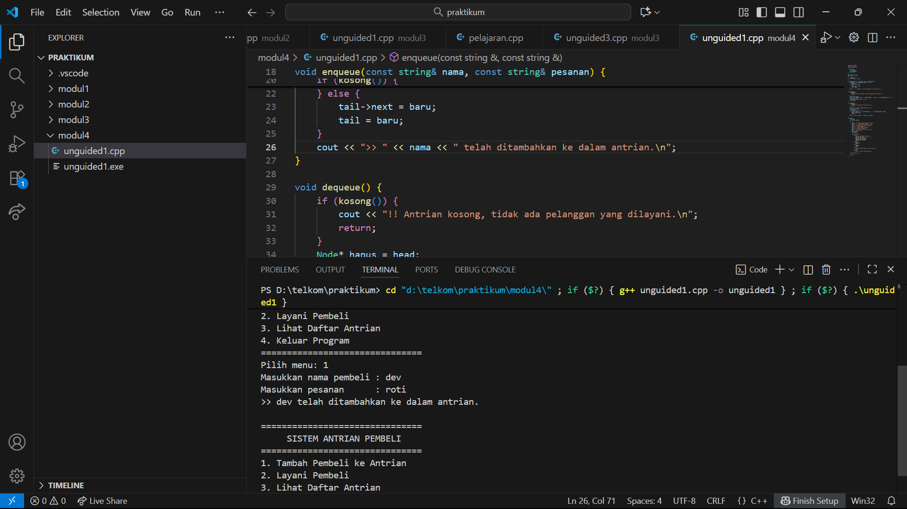
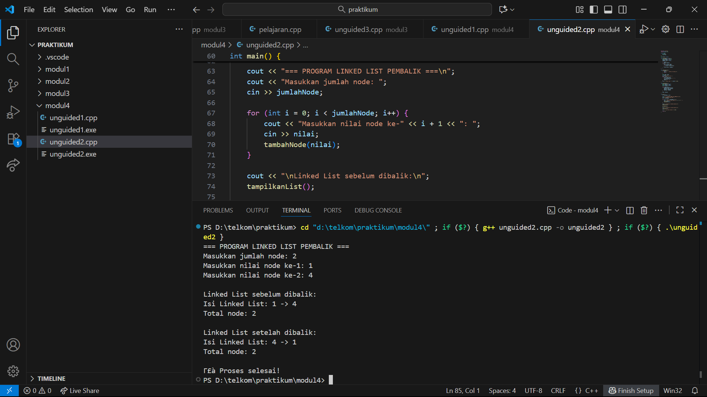

# <h1 align="center">Laporan Praktikum Modul 4 <br> SINGLY LINKED LIST (BAGIAN PERTAMA)</h1>
<p align="center">Akbar Daniel Ruslan - 103112430248</p>

## Dasar Teori

Singly Linked List merupakan struktur data dinamis yang terdiri dari sejumlah node yang saling terhubung secara berurutan. Setiap node menyimpan data dan sebuah penunjuk yang mengarah ke node berikutnya, membentuk rantai satu arah yang berakhir pada nilai null. Struktur ini memungkinkan proses penambahan dan penghapusan elemen dilakukan dengan efisien tanpa perlu menggeser data yang sudah ada. Operasi utamanya meliputi penyisipan, penghapusan, pencarian, dan pembaruan data, yang semuanya diatur menggunakan penunjuk untuk mengelola hubungan antar node.

## Guided

### LINKEDLIST.CPP
```go
#include <iostream>
using namespace std;

// Struktur Node
struct Node {
    int data;
    Node* next;
};

// Pointer awal dan akhir
Node* head = nullptr;

// Fungsi untuk membuat node baru
Node* createNode(int data) {
    Node* newNode = new Node();
    newNode->data = data;
    newNode->next = nullptr;
    return newNode;
}


void insertBelakang(int data) {
    Node* newNode = createNode(data);
    if (head == nullptr) {
        head = newNode;
    } else {
        Node* temp = head;
        while (temp->next != nullptr) {
            temp = temp->next;
        }
        temp->next = newNode;
    }
    cout << "Data " << data << " berhasil ditambahkan di belakang.\n";
}

void insertSetelah(int target, int dataBaru) {
    Node* temp = head;
    while (temp != nullptr && temp->data != target) {
        temp = temp->next;
    }

    if (temp == nullptr) {
        cout << "Data " << target << " tidak ditemukan!\n";
    } else {
        Node* newNode = createNode(dataBaru);
        newNode->next = temp->next;
        temp->next = newNode;
        cout << "Data " << dataBaru << " berhasil disisipkan setelah " << target << ".\n";
    }
}

// ========== DELETE FUNCTION ==========
void hapusNode(int data) {
    if (head == nullptr) {
        cout << "List kosong!\n";
        return;
    }

    Node* temp = head;
    Node* prev = nullptr;

    // Jika data di node pertama
    if (temp != nullptr && temp->data == data) {
        head = temp->next;
        delete temp;
        cout << "Data " << data << " berhasil dihapus.\n";
        return;
    }

    // Cari node yang akan dihapus
    while (temp != nullptr && temp->data != data) {
        prev = temp;
        temp = temp->next;
    }

    // Jika data tidak ditemukan
    if (temp == nullptr) {
        cout << "Data " << data << " tidak ditemukan!\n";
        return;
    }

    prev->next = temp->next;
    delete temp;
    cout << "Data " << data << " berhasil dihapus.\n";
}

// ========== UPDATE FUNCTION ==========
void updateNode(int dataLama, int dataBaru) {
    Node* temp = head;
    while (temp != nullptr && temp->data != dataLama) {
        temp = temp->next;
    }

    if (temp == nullptr) {
        cout << "Data " << dataLama << " tidak ditemukan!\n";
    } else {
        temp->data = dataBaru;
        cout << "Data " << dataLama << " berhasil diupdate menjadi " << dataBaru << ".\n";
    }
}

// ========== DISPLAY FUNCTION ==========
void tampilkanList() {
    if (head == nullptr) {
        cout << "List kosong!\n";
        return;
    }

    Node* temp = head;
    cout << "Isi Linked List: ";
    while (temp != nullptr) {
        cout << temp->data << " -> ";
        temp = temp->next
    }
    cout << "NULL\n";
}

// ========== MAIN PROGRAM ==========
int main() {
    int pilihan, data, target, dataBaru;

    do {
        cout << "\n=== MENU SINGLE LINKED LIST ===\n";
        cout << "1. Insert Depan\n";
        cout << "2. Insert Belakang\n";
        cout << "3. Insert Setelah\n";
        cout << "4. Hapus Data\n";
        cout << "5. Update Data\n";
        cout << "6. Tampilkan List\n";
        cout << "0. Keluar\n";
        cout << "Pilih: ";
        cin >> pilihan;

        switch (pilihan) {
            case 1:
                cout << "Masukkan data: ";
                cin >> data;
                insertDepan(data);
                break;
            case 2:
                cout << "Masukkan data: ";
                cin >> data;
                insertBelakang(data);
                break;
            case 3:
                cout << "Masukkan data target: ";
                cin >> target;
                cout << "Masukkan data baru: ";
                cin >> dataBaru;
                insertSetelah(target, dataBaru);
                break;
            case 4:
                cout << "Masukkan data yang ingin dihapus: ";
                cin >> data;
                hapusNode(data);
                break;
            case 5:
                cout << "Masukkan data lama: ";
                cin >> data;
                cout << "Masukkan data baru: ";
                cin >> dataBaru;
                updateNode(data, dataBaru);
                break;
            case 6:
                tampilkanList();
                break;
            case 0:
                cout << "Program selesai.\n";
                break;
            default:
                cout << "Pilihan tidak valid!\n";
        }
    } while (pilihan != 0);

    return 0;
}
```

## Unguided

### Soal 1

buatlah single linked list untuk Antrian yang menyimpan data pembeli( nama dan pesanan). program memiliki beberapa menu seperti tambah antrian,  layani antrian(hapus), dan tampilkan antrian. \*antrian pertama harus yang pertama dilayani


```go
#include <iostream>
#include <string>
using namespace std;

struct Node {
    string nama;
    string pesanan;
    Node* next;
};

Node* head = nullptr;
Node* tail = nullptr;

bool kosong() {
    return head == nullptr;
}

void enqueue(const string& nama, const string& pesanan) {
    Node* baru = new Node{nama, pesanan, nullptr};
    if (kosong()) {
        head = tail = baru;
    } else {
        tail->next = baru;
        tail = baru;
    }
    cout << ">> " << nama << " telah ditambahkan ke dalam antrian.\n";
}

void dequeue() {
    if (kosong()) {
        cout << "!! Antrian kosong, tidak ada pelanggan yang dilayani.\n";
        return;
    }
    Node* hapus = head;
    cout << ">> Sedang melayani " << hapus->nama << " (Pesanan: " << hapus->pesanan << ")\n";
    head = head->next;
    if (head == nullptr) tail = nullptr;
    delete hapus;
}

void tampil() {
    if (kosong()) {
        cout << "-- Tidak ada antrian saat ini.\n";
        return;
    }
    cout << "\n=== DAFTAR ANTRIAN SAAT INI ===\n";
    Node* bantu = head;
    int nomor = 1;
    while (bantu != nullptr) {
        cout << nomor << ". " << bantu->nama << " - " << bantu->pesanan << endl;
        bantu = bantu->next;
        nomor++;
    }
    cout << "Total pelanggan: " << nomor - 1 << endl;
}

int main() {
    int pilih;
    string nama, pesanan;

    do {
        cout << "\n===============================\n";
        cout << "     SISTEM ANTRIAN PEMBELI    \n";
        cout << "===============================\n";
        cout << "1. Tambah Pembeli ke Antrian\n";
        cout << "2. Layani Pembeli\n";
        cout << "3. Lihat Daftar Antrian\n";
        cout << "4. Keluar Program\n";
        cout << "===============================\n";
        cout << "Pilih menu: ";
        cin >> pilih;
        cin.ignore();

        switch (pilih) {
            case 1:
                cout << "Masukkan nama pembeli : ";
                getline(cin, nama);
                cout << "Masukkan pesanan      : ";
                getline(cin, pesanan);
                enqueue(nama, pesanan);
                break;
            case 2:
                dequeue();
                break;
            case 3:
                tampil();
                break;
            case 4:
                cout << "Program selesai. Terima kasih!\n";
                break;
            default:
                cout << "Pilihan tidak dikenal!\n";
        }
    } while (pilih != 4);

    return 0;
}
```

> Output
> 
 
Program ini menerapkan konsep queue (antrian) menggunakan struktur data linked list untuk menyimpan data pembeli beserta pesanan mereka. Setiap node berisi informasi nama dan pesanan, serta pointer next yang menghubungkan node satu dengan lainnya secara berurutan. Program ini menyediakan menu interaktif yang memungkinkan pengguna menambah pembeli ke dalam antrian (enqueue), melayani pembeli dari urutan terdepan (dequeue), dan menampilkan seluruh daftar antrian berikut jumlah pembeli yang masih menunggu. Dengan menggunakan linked list, antrian menjadi bersifat dinamis tanpa batasan ukuran tertentu, sehingga proses penambahan dan penghapusan elemen dapat dilakukan dengan efisien dan fleksibel.

### Soal 2

buatlah program kode untuk membalik (reverse) singly linked list (1-2-3 menjadi 3-2-1) 

```go
#include <iostream>
using namespace std;

struct Node {
    int data;
    Node* next;
};

Node* head = nullptr;

void tambahNode(int nilai) {
    Node* nodeBaru = new Node;
    nodeBaru->data = nilai;
    nodeBaru->next = nullptr;

    if (!head) {
        head = nodeBaru;
    } else {
        Node* current = head;
        while (current->next) {
            current = current->next;
        }
        current->next = nodeBaru;
    }
}

void tampilkanList() {
    if (!head) {
        cout << "⚠️  Linked List kosong.\n";
        return;
    }

    Node* temp = head;
    int jumlah = 0;
    cout << "Isi Linked List: ";
    while (temp) {
        cout << temp->data;
        if (temp->next) cout << " -> ";
        temp = temp->next;
        jumlah++;
    }
    cout << "\nTotal node: " << jumlah << endl;
}

void balikkanList() {
    Node* sebelum = nullptr;
    Node* sekarang = head;
    Node* sesudah = nullptr;

    while (sekarang) {
        sesudah = sekarang->next;
        sekarang->next = sebelum;
        sebelum = sekarang;
        sekarang = sesudah;
    }

    head = sebelum;
}

int main() {
    int jumlahNode, nilai;

    cout << "=== PROGRAM LINKED LIST PEMBALIK ===\n";
    cout << "Masukkan jumlah node: ";
    cin >> jumlahNode;

    for (int i = 0; i < jumlahNode; i++) {
        cout << "Masukkan nilai node ke-" << i + 1 << ": ";
        cin >> nilai;
        tambahNode(nilai);
    }

    cout << "\nLinked List sebelum dibalik:\n";
    tampilkanList();

    balikkanList();

    cout << "\nLinked List setelah dibalik:\n";
    tampilkanList();

    cout << "\n✅ Proses selesai!" << endl;

    return 0;
}
```

> Output
> 

Program ini membangun singly linked list yang memungkinkan penambahan node secara dinamis di bagian akhir list. Setiap node menyimpan data bertipe integer dan dihubungkan menggunakan pointer next. Program menyediakan fitur untuk menampilkan seluruh isi linked list serta membalik urutan node melalui fungsi balikkanList() yang memanfaatkan manipulasi pointer. Dengan input dari pengguna, node ditambahkan satu per satu, kemudian urutannya dibalik tanpa membuat list baru. Struktur linked list ini efisien karena perubahan data dilakukan langsung melalui pointer, sehingga tidak memerlukan pemindahan elemen di memori.


## Referensi

1. https://www.w3schools.com/cpp/cpp_for_loop_nested.asp
2. https://www.w3schools.com/cpp/cpp_arrays.asp
3. https://www.w3schools.com/cpp/cpp_arrays_loop.asp
4. https://www.w3schools.com/cpp/cpp_references.asp
5. https://www.w3schools.com/cpp/cpp_pointers.asp
