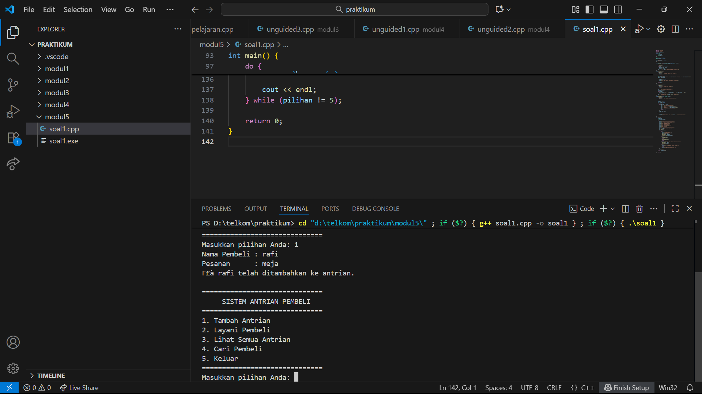

# <h1 align="center">Laporan Praktikum Modul 5 <br> SINGLY LINKED LIST (BAGIAN KEDUA)</h1>
<p align="center">Akbar Daniel Ruslan - 103112430248 </p>

## Dasar Teori

Singly Linked List merupakan salah satu jenis struktur data yang tersusun dari rangkaian elemen atau node yang saling terhubung menggunakan pointer. Setiap node terdiri dari dua bagian, yaitu data yang menyimpan nilai dan pointer yang mengarah ke node berikutnya. Berbeda dari array yang memiliki ukuran tetap, singly linked list bersifat dinamis, sehingga memudahkan proses penambahan maupun penghapusan elemen tanpa perlu menggeser data lainnya. Operasi dasar yang dapat dilakukan meliputi pembuatan list kosong, penambahan dan penghapusan elemen, pencarian data tertentu, serta pembaruan nilai. Proses pencarian dilakukan dengan menelusuri node secara berurutan dari awal hingga data yang diinginkan ditemukan, sedangkan operasi penambahan dan penghapusan dilakukan dengan mengubah hubungan pointer antar node. Struktur ini menawarkan fleksibilitas dan efisiensi dalam pengelolaan data, meskipun memiliki kelemahan karena akses data harus dilakukan secara berurutan dan membutuhkan memori tambahan untuk menyimpan pointer. Singly linked list juga menjadi dasar dalam memahami struktur data yang lebih kompleks seperti doubly linked list dan circular linked list.


## Guided

### LINKEDLIST.CPP
```go
#include <iostream>
using namespace std;

// Struktur Node
struct Node {
    int data;
    Node* next;
};

// Pointer awal dan akhir
Node* head = nullptr;

// Fungsi untuk membuat node baru
Node* createNode(int data) {
    Node* newNode = new Node();
    newNode->data = data;
    newNode->next = nullptr;
    return newNode;
}


void insertBelakang(int data) {
    Node* newNode = createNode(data);
    if (head == nullptr) {
        head = newNode;
    } else {
        Node* temp = head;
        while (temp->next != nullptr) {
            temp = temp->next;
        }
        temp->next = newNode;
    }
    cout << "Data " << data << " berhasil ditambahkan di belakang.\n";
}

void insertSetelah(int target, int dataBaru) {
    Node* temp = head;
    while (temp != nullptr && temp->data != target) {
        temp = temp->next;
    }

    if (temp == nullptr) {
        cout << "Data " << target << " tidak ditemukan!\n";
    } else {
        Node* newNode = createNode(dataBaru);
        newNode->next = temp->next;
        temp->next = newNode;
        cout << "Data " << dataBaru << " berhasil disisipkan setelah " << target << ".\n";
    }
}

// ========== DELETE FUNCTION ==========
void hapusNode(int data) {
    if (head == nullptr) {
        cout << "List kosong!\n";
        return;
    }

    Node* temp = head;
    Node* prev = nullptr;

    // Jika data di node pertama
    if (temp != nullptr && temp->data == data) {
        head = temp->next;
        delete temp;
        cout << "Data " << data << " berhasil dihapus.\n";
        return;
    }

    // Cari node yang akan dihapus
    while (temp != nullptr && temp->data != data) {
        prev = temp;
        temp = temp->next;
    }

    // Jika data tidak ditemukan
    if (temp == nullptr) {
        cout << "Data " << data << " tidak ditemukan!\n";
        return;
    }

    prev->next = temp->next;
    delete temp;
    cout << "Data " << data << " berhasil dihapus.\n";
}

// ========== UPDATE FUNCTION ==========
void updateNode(int dataLama, int dataBaru) {
    Node* temp = head;
    while (temp != nullptr && temp->data != dataLama) {
        temp = temp->next;
    }

    if (temp == nullptr) {
        cout << "Data " << dataLama << " tidak ditemukan!\n";
    } else {
        temp->data = dataBaru;
        cout << "Data " << dataLama << " berhasil diupdate menjadi " << dataBaru << ".\n";
    }
}

// ========== DISPLAY FUNCTION ==========
void tampilkanList() {
    if (head == nullptr) {
        cout << "List kosong!\n";
        return;
    }

    Node* temp = head;
    cout << "Isi Linked List: ";
    while (temp != nullptr) {
        cout << temp->data << " -> ";
        temp = temp->next
    }
    cout << "NULL\n";
}

// ========== MAIN PROGRAM ==========
int main() {
    int pilihan, data, target, dataBaru;

    do {
        cout << "\n=== MENU SINGLE LINKED LIST ===\n";
        cout << "1. Insert Depan\n";
        cout << "2. Insert Belakang\n";
        cout << "3. Insert Setelah\n";
        cout << "4. Hapus Data\n";
        cout << "5. Update Data\n";
        cout << "6. Tampilkan List\n";
        cout << "0. Keluar\n";
        cout << "Pilih: ";
        cin >> pilihan;

        switch (pilihan) {
            case 1:
                cout << "Masukkan data: ";
                cin >> data;
                insertDepan(data);
                break;
            case 2:
                cout << "Masukkan data: ";
                cin >> data;
                insertBelakang(data);
                break;
            case 3:
                cout << "Masukkan data target: ";
                cin >> target;
                cout << "Masukkan data baru: ";
                cin >> dataBaru;
                insertSetelah(target, dataBaru);
                break;
            case 4:
                cout << "Masukkan data yang ingin dihapus: ";
                cin >> data;
                hapusNode(data);
                break;
            case 5:
                cout << "Masukkan data lama: ";
                cin >> data;
                cout << "Masukkan data baru: ";
                cin >> dataBaru;
                updateNode(data, dataBaru);
                break;
            case 6:
                tampilkanList();
                break;
            case 0:
                cout << "Program selesai.\n";
                break;
            default:
                cout << "Pilihan tidak valid!\n";
        }
    } while (pilihan != 0);

    return 0;
}
```

### SEARCHING.CPP
```go
#include <iostream>
using namespace std;

#define Nil nullptr

// Deklarasi struktur Node
struct Node {
    int info;
    Node* next;

    Node(int value) {
        info = value;
        next = Nil;
    }
};

// Kelas List
class List {
private:
    Node* first;

public:
    // Konstruktor
    List() {
        first = Nil;
    }

    // Mengecek apakah list kosong
    bool isEmpty() {
        return first == Nil;
    }

    // Membuat list kosong
    void createList() {
        first = Nil;
    }

    // Menampilkan isi list
    void printInfo() {
        if (isEmpty()) {
            cout << "List kosong" << endl;
        } else {
            Node* p = first;
            cout << "Isi list: ";
            while (p != Nil) {
                cout << p->info << " ";
                p = p->next;
            }
            cout << endl;
        }
    }

    // Menghitung jumlah elemen
    int nbList() {
        int count = 0;
        Node* p = first;
        while (p != Nil) {
            count++;
            p = p->next;
        }
        return count;
    }

    // Menyisipkan elemen di awal
    void insertFirst(int value) {
        Node* p = new Node(value);
        p->next = first;
        first = p;
    }

    // Menyisipkan elemen di akhir
    void insertLast(int value) {
        Node* p = new Node(value);
        if (isEmpty()) {
            first = p;
        } else {
            Node* last = first;
            while (last->next != Nil) {
                last = last->next;
            }
            last->next = p;
        }
    }

    // Menyisipkan elemen setelah node tertentu
    void insertAfter(Node* prec, int value) {
        if (prec != Nil) {
            Node* p = new Node(value);
            p->next = prec->next;
            prec->next = p;
        }
    }

    // Menghapus elemen pertama
    void delFirst() {
        if (!isEmpty()) {
            Node* temp = first;
            first = first->next;
            delete temp;
        }
    }

    // Menghapus elemen terakhir
    void delLast() {
        if (!isEmpty()) {
            if (first->next == Nil) {
                delete first;
                first = Nil;
            } else {
                Node* prev = Nil;
                Node* curr = first;
                while (curr->next != Nil) {
                    prev = curr;
                    curr = curr->next;
                }
                prev->next = Nil;
                delete curr;
            }
        }
    }

    // Menghapus elemen setelah node tertentu
    void delAfter(Node* prec) {
        if (prec != Nil && prec->next != Nil) {
            Node* temp = prec->next;
            prec->next = temp->next;
            delete temp;
        }
    }

    // Menghapus elemen dengan nilai tertentu
    void delP(int value) {
        if (isEmpty()) return;

        Node* curr = first;
        Node* prev = Nil;

        while (curr != Nil && curr->info != value) {
            prev = curr;
            curr = curr->next;
        }

        if (curr != Nil) { // ditemukan
            if (prev == Nil)
                first = curr->next;
            else
                prev->next = curr->next;
            delete curr;
        }
    }

    // Mencari elemen dengan nilai tertentu
    Node* findElm(int value) {
        Node* p = first;
        while (p != Nil) {
            if (p->info == value)
                return p;
            p = p->next;
        }
        return Nil;
    }

    // Membalik urutan elemen list
    void invertList() {
        Node* prev = Nil;
        Node* curr = first;
        Node* next = Nil;

        while (curr != Nil) {
            next = curr->next;
            curr->next = prev;
            prev = curr;
            curr = next;
        }
        first = prev;
    }

    // Menghapus semua elemen list
    void delAll() {
        Node* p = first;
        while (p != Nil) {
            Node* temp = p;
            p = p->next;
            delete temp;
        }
        first = Nil;
    }

    // Menyalin isi list ke list lain
    void copyList(List &L2) {
        delAll();
        Node* p = first;
        while (p != Nil) {
            L2.insertLast(p->info);
            p = p->next;
        }
    }

    // Destruktor
    ~List() {
        delAll();
    }
};

// Contoh penggunaan dalam main
int main() {
    List L;

    cout << "=== Program Linked List C++ ===" << endl;

    L.insertFirst(10);
    L.insertFirst(5);
    L.insertLast(15);
    L.insertLast(20);

    L.printInfo(); // Output: 5 10 15 20
    cout << "Jumlah elemen: " << L.nbList() << endl;

    cout << "Hapus elemen pertama..." << endl;
    L.delFirst();
    L.printInfo();

    cout << "Hapus elemen terakhir..." << endl;
    L.delLast();
    L.printInfo();

    cout << "Cari elemen bernilai 10..." << endl;
    Node* found = L.findElm(10);
    if (found) cout << "Ditemukan: " << found->info << endl;
    else cout << "Tidak ditemukan" << endl;

    cout << "Balik urutan list..." << endl;
    L.invertList();
    L.printInfo();

    cout << "Hapus semua elemen..." << endl;
    L.delAll();
    L.printInfo();

    return 0;
}
```

## Unguided

### Soal 1

buatlah searcing untuk mencari nama pembeli pada unguided sebelumnya

```go
#include <iostream>
#include <string>
using namespace std;

struct Node {
    string nama;
    string pesanan;
    Node* next;
};

Node* depan = nullptr;
Node* belakang = nullptr;

bool kosong() {
    return depan == nullptr;
}

void tambahAntrian(const string& nama, const string& pesanan) {
    Node* baru = new Node{nama, pesanan, nullptr};

    if (kosong()) {
        depan = belakang = baru;
    } else {
        belakang->next = baru;
        belakang = baru;
    }
    cout << "✅ " << nama << " telah ditambahkan ke antrian.\n";
}

void layaniAntrian() {
    if (kosong()) {
        cout << "⚠️  Tidak ada pembeli dalam antrian.\n";
        return;
    }

    Node* hapus = depan;
    cout << "👤 Melayani pembeli: " << hapus->nama << " | Pesanan: " << hapus->pesanan << endl;
    depan = depan->next;

    if (!depan) {
        belakang = nullptr;
        cout << "📭 Semua antrian telah selesai dilayani.\n";
    }

    delete hapus;
}

void tampilkanAntrian() {
    if (kosong()) {
        cout << "📭 Antrian masih kosong.\n";
        return;
    }

    cout << "\n📋 Daftar Antrian Saat Ini:\n";
    Node* temp = depan;
    int nomor = 1;
    while (temp) {
        cout << nomor++ << ". " << temp->nama << " - " << temp->pesanan << endl;
        temp = temp->next;
    }
    cout << "Total antrian: " << nomor - 1 << " pembeli\n\n";
}

void cariPembeli(const string& dicari) {
    if (kosong()) {
        cout << "📭 Tidak ada antrian untuk dicari.\n";
        return;
    }

    Node* temp = depan;
    int posisi = 1;
    bool ketemu = false;

    while (temp) {
        if (temp->nama == dicari) {
            cout << "\n✅ Pembeli ditemukan!\n";
            cout << "Posisi ke-" << posisi << endl;
            cout << "Nama     : " << temp->nama << endl;
            cout << "Pesanan  : " << temp->pesanan << endl;
            cout << "-----------------------------\n";
            ketemu = true;
            break;
        }
        temp = temp->next;
        posisi++;
    }

    if (!ketemu) {
        cout << "❌ Pembeli dengan nama \"" << dicari << "\" tidak ditemukan.\n";
    }
}

int main() {
    int pilihan;
    string nama, pesanan;

    do {
        cout << "==============================\n";
        cout << "     SISTEM ANTRIAN PEMBELI   \n";
        cout << "==============================\n";
        cout << "1. Tambah Antrian\n";
        cout << "2. Layani Pembeli\n";
        cout << "3. Lihat Semua Antrian\n";
        cout << "4. Cari Pembeli\n";
        cout << "5. Keluar\n";
        cout << "==============================\n";
        cout << "Masukkan pilihan Anda: ";
        cin >> pilihan;
        cin.ignore();

        switch (pilihan) {
            case 1:
                cout << "Nama Pembeli : ";
                getline(cin, nama);
                cout << "Pesanan      : ";
                getline(cin, pesanan);
                tambahAntrian(nama, pesanan);
                break;
            case 2:
                layaniAntrian();
                break;
            case 3:
                tampilkanAntrian();
                break;
            case 4:
                cout << "Masukkan nama pembeli yang ingin dicari: ";
                getline(cin, nama);
                cariPembeli(nama);
                break;
            case 5:
                cout << "👋 Terima kasih, program selesai.\n";
                break;
            default:
                cout << "❌ Pilihan tidak tersedia.\n";
        }

        cout << endl;
    } while (pilihan != 5);

    return 0;
}
```

> Output
> 

Program ini merupakan implementasi struktur data queue (antrian) menggunakan singly linked list. Setiap node dalam antrian menyimpan data berupa nama pembeli dan pesanan yang dilakukan. Program menyediakan beberapa fitur utama, yaitu menambahkan pembeli ke dalam antrian, melayani pembeli yang berada di posisi terdepan, menampilkan seluruh daftar antrian beserta jumlah total pembeli, serta mencari pembeli tertentu berdasarkan nama. Dengan menggunakan linked list, proses penambahan dan penghapusan elemen dilakukan secara dinamis tanpa perlu memindahkan data lainnya, sehingga pengelolaan antrian menjadi lebih efisien dan fleksibel.

### Soal 2

gunakan latihan pada pertemuan minggun ini dan tambahkan seardhing untuk mencari buku berdasarkan judul, penulis, dan ISBN

```go
#include <iostream>
#include <string>
using namespace std;

struct Buku {
    string isbn;
    string judul;
    string penulis;
    Buku* next;
};

Buku* awal = nullptr;

void tambahData(string isbn, string judul, string penulis) {
    Buku* baru = new Buku;
    baru->isbn = isbn;
    baru->judul = judul;
    baru->penulis = penulis;
    baru->next = nullptr;

    if (awal == nullptr) {
        awal = baru;
    } else {
        Buku* temp = awal;
        while (temp->next != nullptr) {
            temp = temp->next;
        }
        temp->next = baru;
    }

    cout << "✅ Data buku berhasil ditambahkan!\n";
}

void tampilData() {
    if (awal == nullptr) {
        cout << "📭 Belum ada buku yang terdaftar.\n";
        return;
    }

    Buku* temp = awal;
    int jumlah = 0;
    cout << "\n📚 Daftar Buku Tersimpan:\n";
    cout << "-------------------------\n";
    while (temp != nullptr) {
        cout << "ISBN    : " << temp->isbn << endl;
        cout << "Judul   : " << temp->judul << endl;
        cout << "Penulis : " << temp->penulis << endl;
        cout << "-------------------------\n";
        temp = temp->next;
        jumlah++;
    }
    cout << "Total data buku: " << jumlah << " buah\n";
}

void hapusData(string isbn) {
    if (awal == nullptr) {
        cout << "⚠️ Tidak ada data untuk dihapus.\n";
        return;
    }

    Buku* temp = awal;
    Buku* sebelum = nullptr;

    while (temp != nullptr && temp->isbn != isbn) {
        sebelum = temp;
        temp = temp->next;
    }

    if (temp == nullptr) {
        cout << "❌ Buku dengan ISBN " << isbn << " tidak ditemukan.\n";
        return;
    }

    if (sebelum == nullptr)
        awal = awal->next;
    else
        sebelum->next = temp->next;

    delete temp;
    cout << "🗑️ Buku telah dihapus dari daftar.\n";
}

void ubahData(string isbn) {
    Buku* temp = awal;
    while (temp != nullptr && temp->isbn != isbn) {
        temp = temp->next;
    }

    if (temp == nullptr) {
        cout << "❌ Buku tidak ditemukan.\n";
        return;
    }

    cout << "Masukkan judul baru: ";
    getline(cin, temp->judul);
    cout << "Masukkan penulis baru: ";
    getline(cin, temp->penulis);

    cout << "✅ Data buku berhasil diperbarui!\n";
}

void cariISBN(string isbn) {
    Buku* temp = awal;
    while (temp != nullptr) {
        if (temp->isbn == isbn) {
            cout << "\n📗 Buku ditemukan:\n";
            cout << "ISBN    : " << temp->isbn << endl;
            cout << "Judul   : " << temp->judul << endl;
            cout << "Penulis : " << temp->penulis << endl;
            cout << "-------------------------\n";
            return;
        }
        temp = temp->next;
    }
    cout << "❌ Buku dengan ISBN " << isbn << " tidak ditemukan.\n";
}

void cariJudul(string judul) {
    Buku* temp = awal;
    bool ditemukan = false;
    cout << "\n📕 Hasil pencarian berdasarkan judul \"" << judul << "\":\n";
    while (temp != nullptr) {
        if (temp->judul == judul) {
            cout << "ISBN    : " << temp->isbn << endl;
            cout << "Penulis : " << temp->penulis << endl;
            cout << "-------------------------\n";
            ditemukan = true;
        }
        temp = temp->next;
    }
    if (!ditemukan)
        cout << "❌ Tidak ada buku dengan judul tersebut.\n";
}

void cariPenulis(string penulis) {
    Buku* temp = awal;
    bool ditemukan = false;
    cout << "\n📘 Hasil pencarian buku karya \"" << penulis << "\":\n";
    while (temp != nullptr) {
        if (temp->penulis == penulis) {
            cout << "ISBN  : " << temp->isbn << endl;
            cout << "Judul : " << temp->judul << endl;
            cout << "-------------------------\n";
            ditemukan = true;
        }
        temp = temp->next;
    }
    if (!ditemukan)
        cout << "❌ Tidak ditemukan buku dari penulis tersebut.\n";
}

int main() {
    int pilihan;
    string isbn, judul, penulis;

    do {
        cout << "\n=== 📚 MENU MANAJEMEN DATA BUKU ===\n";
        cout << "1. Tambah Buku\n";
        cout << "2. Hapus Buku\n";
        cout << "3. Ubah Data Buku\n";
        cout << "4. Tampilkan Semua Buku\n";
        cout << "5. Cari Berdasarkan ISBN\n";
        cout << "6. Cari Berdasarkan Judul\n";
        cout << "7. Cari Berdasarkan Penulis\n";
        cout << "8. Keluar\n";
        cout << "====================================\n";
        cout << "Pilih menu: ";
        cin >> pilihan;
        cin.ignore();

        switch (pilihan) {
            case 1:
                cout << "Masukkan ISBN: ";
                getline(cin, isbn);
                cout << "Masukkan Judul: ";
                getline(cin, judul);
                cout << "Masukkan Penulis: ";
                getline(cin, penulis);
                tambahData(isbn, judul, penulis);
                break;
            case 2:
                cout << "Masukkan ISBN buku yang ingin dihapus: ";
                getline(cin, isbn);
                hapusData(isbn);
                break;
            case 3:
                cout << "Masukkan ISBN buku yang ingin diperbarui: ";
                getline(cin, isbn);
                ubahData(isbn);
                break;
            case 4:
                tampilData();
                break;
            case 5:
                cout << "Masukkan ISBN yang ingin dicari: ";
                getline(cin, isbn);
                cariISBN(isbn);
                break;
            case 6:
                cout << "Masukkan Judul buku yang ingin dicari: ";
                getline(cin, judul);
                cariJudul(judul);
                break;
            case 7:
                cout << "Masukkan nama Penulis yang ingin dicari: ";
                getline(cin, penulis);
                cariPenulis(penulis);
                break;
            case 8:
                cout << "👋 Terima kasih! Program selesai.\n";
                break;
            default:
                cout << "❌ Pilihan tidak tersedia.\n";
        }
    } while (pilihan != 8);

    return 0;
}


```

> Output
> 

Program ini menerapkan singly linked list untuk menyimpan informasi buku, di mana setiap node berisi data ISBN, judul, dan penulis. Program menyediakan fitur untuk menambahkan buku baru, menghapus buku, memperbarui data buku, menampilkan semua buku yang tersimpan, serta mencari buku berdasarkan ISBN, judul, atau penulis. Penggunaan linked list memungkinkan penambahan dan penghapusan data dilakukan secara dinamis tanpa perlu memindahkan elemen lain, sehingga lebih fleksibel dibandingkan dengan array. Program juga menampilkan total buku dan memberikan konfirmasi pada setiap perubahan, membuatnya lebih informatif dan mudah digunakan oleh pengguna.

## Referensi

1. https://www.w3schools.com/cpp/cpp_for_loop_nested.asp
2. https://www.w3schools.com/cpp/cpp_arrays.asp
3. https://www.w3schools.com/cpp/cpp_arrays_loop.asp
4. https://www.w3schools.com/cpp/cpp_references.asp

